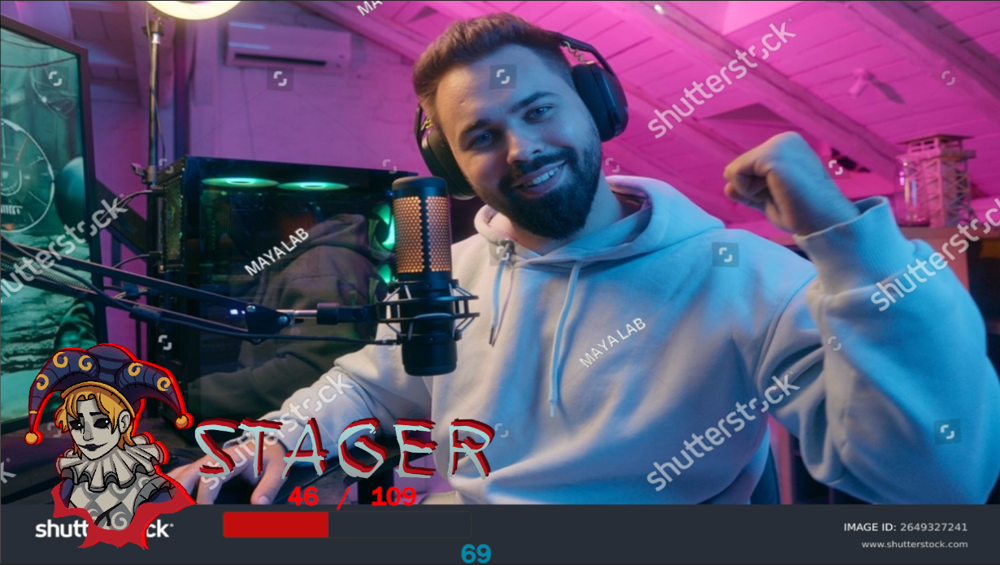
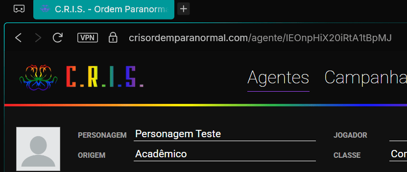
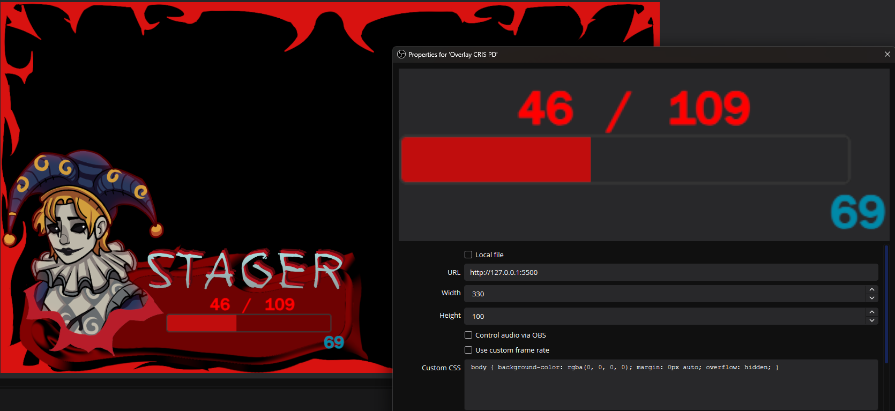
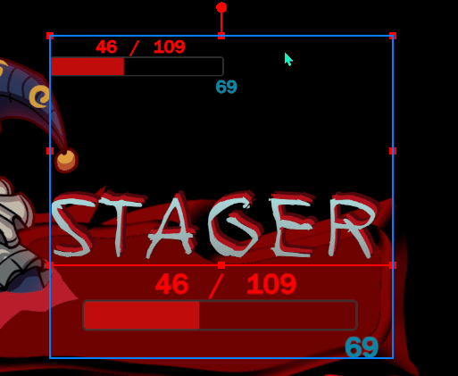
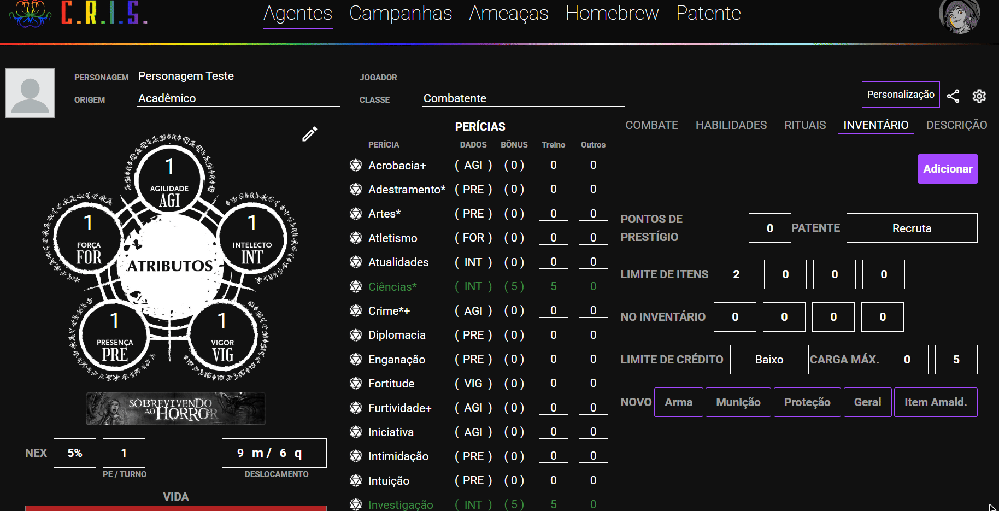
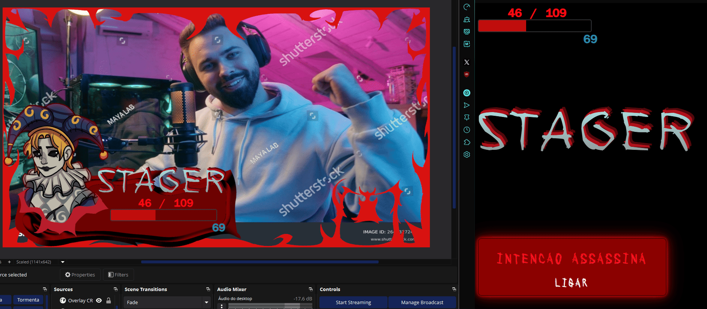

# Overlay para o CRIS - Ordem Paranormal

Uma overlay personalizada para OBS Studio que integra com o CRIS (sistema de fichas de RPG para Ordem Paranormal), exibindo em tempo real os status do personagem com a sua webcam.



## 📋 Funcionalidades

- **Status em Tempo Real**: Exibe PV (Pontos de Vida) atual e máximo, PD (Pontos de Esforço) atual e o Nome do Personagem
- **Barra de Vida Dinâmica**: Barra de progresso que muda de cor conforme a quantidade de vida
- **Portrait de personagem**: Display de ícone do personagem 
- **(HEXATOMBE) Mecânica de Intenção Assassina**: Botão interativo para ativar/desativar a forma suprema:
  - Altera o nome do personagem na ficha entre as formas (Stager ↔ Jester)
  - Ajusta PV, PD e bônus de defesa automaticamente
  - Altera as imagens do Portrait do site

## 🛠️ Tecnologias Utilizadas

- HTML5
- CSS3
- JavaScript (Vanilla)
- Firebase Firestore API
- OBS Browser Source

## 🚀 Como Usar

### Pré-requisitos
- Visual Studio Code
    - Extensão "Live Server" do Visual Studio
- OBS Studio instalado
- Uma ficha de personagem no CRIS
- URL da API do Firestore do seu personagem


### Configuração do Código
- Abra a pasta do overlay no aplicativo Visual Studio Code e baixe a extensão "Live Server" para editar o projeto
- Configurações `index.html`
    - Preencha o nome do seu personagem na página HTML
    ```html
    <h1 id="character-name">NOME PERSONAGEM</h1>
    ```
- Configurações `stats.js`
    - Linha 26 -> Você precisa substituir o final da URL com o ID do seu personagem
    ```js
    API_URL: "https://firestore.googleapis.com/v1/projects/seu-projeto/databases/(default)/documents/characters/SEU-ID"
    ```
    
    - Linha 205 -> Para usar as imagens de portrait do site, você precisa colocar a imagem na pasta do projeto e alterar o valor da variável dessa linha (Ex: App.elements.characterPortrait.src = "Previews/MeuPortrait.png";)
    ```js
    App.elements.characterPortrait.src = assassinIntent ? "Previews/blank2.png" : "Previews/blank.png";
    ```
        - Certifique que a imagem é quadrada (mesma quantia de pixels em largura e altura)
- Configurações `styles.css` (apenas se for usar o nome do personagem pelo site)
    - Caso queira usar o overlay para mostrar o nome do personagem, será necessário alterar as propriedades do ID #character-name
    ```css
    #character-name {
        font-family: 'echoes';  /*FONTE DO TEXTO*/
        font-size: 144px;   /*TAMANHO DA FONTE*/
        background: -webkit-linear-gradient(#afe7e8, #8b8b8b);  /*COR DO TEXTO (GRADIENTE)*/
        -webkit-background-clip: text;
        background-clip: text;
        -webkit-text-fill-color: transparent;
        letter-spacing: 0.12em;     /*ESPAÇAMENTO DAS LETRAS*/
        filter: drop-shadow(4px -0.05em 0px #af111c) drop-shadow(6px -0.03em 0px #52080d); /*EFEITO DE SOMBRA DO NOME*/
    }
    ```
    - Não existe um número mágico que é compatível com todos os nomes e as configurações devem ser ajustadas à gosto, essa configuração padrão é uma que achei compatível com nomes de aproximadamente 6 letras de comprimento
- Após configurar os arquivos, basta selecionar o arquivo `Index.html` e clicar em `Go Live` no canto inferior direito do Visual Studio.

### Configuração do OBS
- (Barra de Vida + PD) No OBS, crie uma fonte "Navegador" na sua cena, utilizando o link do site que foi aberto pelo Live Server, com as dimensões 330 de Largura e 100 de Altura

- (Portrait) No OBS, crie uma fonte "Navegador" na sua cena, utilizando o link do site que foi aberto pelo Live Server, com as dimensões 512 de Largura e 612 de Altura.
    - Para "recortar" a fonte de um jeito que apenas a imagem apareça, basta segurar `Alt` e ajustar as dimensões. 
- (Nome) No OBS, crie uma fonte "Navegador" na sua cena, utilizando o link do site que foi aberto pelo Live Server, com as dimensões ~600 de Largura e ~900 de Altura (as dimensões ideais podem variar dependendo do tamanho do nome do seu personagem).
    - Para "recortar" a fonte de um jeito que apenas o nome apareça, basta segurar `Alt` e diminuir a imagem pelo topo 


### Mecânica Extra de Hexatombe (Intenção Assassina)
- Para ativar a mecânica extra será necesário editar mais um pouco dos scripts:
- Configurações `stats.js`
    - Linha 2 -> Colocar a variável de Intenção Assassina como `true`
    ```js
    const IntencaoAssassina = false; // true = função ligada, false = função desligada
    ```
    - Linha 94 -> Você precisa alterar os valores para serem seu nome na forma de intenção, e na forma padrão (ex: "Mutilador Noturno" : "Aguiar")
    ```js
    updatedFields.name.stringValue = isActive ? "NOME DE INTENCAO" : "NOME PADRAO";
    ```
    - Linha 205 -> Para trocar entre as imagens de portrait, basta manter no mesmo padrão que já está no código. Com a primeira imagem sendo a versão normal e a segunda sendo a de intenção. (Ex: App.elements.characterPortrait.src = assassinIntent ? "Previews/Intencao.ong" : "Previews/Normal.png";)
    ```js
    App.elements.characterPortrait.src = assassinIntent ? "Previews/blank2.png" : "Previews/blank.png";
    ```
        - Certifique que a imagem é quadrada (mesma quantia de pixels em largura e altura)
    - Linha 212 até 224 -> Essa parte corresponde ao CSS do nome de cada versão, ela deve ser editada à gosto assim como na configuração original do CSS. O bloco de cima corresponde a forma de intenção assassina, e o bloco de baixo corresponde a forma padrão.
    ```js
    if (assassinIntent === true) {
        element.style.fontFamily = 'onryou';
        element.style.background = '-webkit-linear-gradient(#e80000, #ff0303)';
        element.style.webkitBackgroundClip = 'text';
        element.style.letterSpacing = '0.2em';
        element.style.fontSize = '144px';
    } else {
        element.style.fontFamily = 'echoes';
        element.style.background = '-webkit-linear-gradient(#afe7e8, #8b8b8b)';
        element.style.webkitBackgroundClip = 'text';
        element.style.letterSpacing = '0.12em';
        element.style.fontSize = '144px';
    }
    ```
- Configurações `CRIS - ORDEM PARANORMAL`
    - Na ferramenta do CRIS, você precisa criar uma Proteção customizada de 0 de defesa, 0 de peso e categoria 0 no seu inventário, com o nome `(Intenção Assassina)`, e é importante que seja escrito dessa exata forma
        - Nunca ative/desative esse item manualmente, pois o site usa ela para saber se você está ou não em sua forma de intenção, caso desative manualmente, corre risco de desconfigurar sua vida máxima, determinação máxima e defesa
    



## 🤝 Contribuindo
Contribuições são bem-vindas! Sinta-se à vontade para:
- Reportar bugs
- Sugerir novas funcionalidades
- Melhorar a documentação

## 🙏 Agradecimentos
- **Ordem Paranormal - Sistema de RPG**
- **CRIS - Ferramenta de fichas de RPG**

**Nota:** Este é um projeto de fã desenvolvido para uso pessoal e não comercial. Não possui vínculo oficial com o CRIS ou com a marca Ordem Paranormal.

**Nota²:** Nas demonstrações visuais não há alterações de PD para eu não zerar os da minha ficha de campanha fazendo os testes, no script você perde 6 PD a cada vez que ativa a intenção assassina.